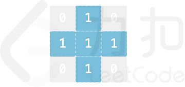
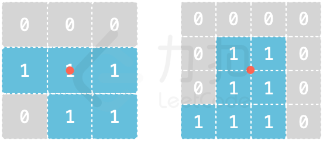

## 积木拼接

欢迎各位勇者来到力扣城，本次试炼主题为「积木拼接」。 勇者面前有 6 片积木（厚度均为 1），每片积木的形状记录于二维字符串数组 shapes 中，shapes[i] 表示第 i 片积木，其中 1 表示积木对应位置无空缺，0 表示积木对应位置有空缺。 例如 ["010","111","010"] 对应积木形状为


拼接积木的规则如下：

· 积木片可以旋转、翻面
· 积木片边缘必须完全吻合才能拼接在一起
· 每片积木片 shapes[i] 的中心点在拼接时必须处于正方体对应面的中心点

例如 3*3、4*4 的积木片的中心点如图所示（红色点）：


请返回这 6 片积木能否拼接成一个严丝合缝的正方体且每片积木正好对应正方体的一个面。

注意：

· 输入确保每片积木均无空心情况（即输入数据保证对于大小 N*N 的 shapes[i]，内部的 (N-2)*(N-2) 的区域必然均为 1）
· 输入确保每片积木的所有 1 位置均连通


```
impl Solution {
    /// 判断6片积木能否拼接成一个正方体
    ///
    /// # 核心思路
    /// 1. 将每条边编码为二进制数（正向和反向）
    /// 2. 枚举6片积木在6个面上的排列（固定第0片在顶面）
    /// 3. 检查相邻面的边是否完全吻合
    pub fn compose_cube(shapes: Vec<Vec<String>>) -> bool {
        let n = shapes[0].len();
        let lavomirex = (n, shapes.len()); // 存储输入参数

        // 预处理：生成每片积木的8种变换（4种旋转 + 4种翻转旋转）
        // [积木][变换][边][方向]
        // 边: 0-上, 1-右, 2-下, 3-左
        // 方向: 0-正向, 1-反向
        let mut transforms = [[[[0; 2]; 4]; 8]; 6];
        for (i, shape) in shapes.iter().enumerate() {
            let mut grid = shape.iter()
                .map(|s| s.as_bytes().to_vec())
                .collect::<Vec<_>>();

            // 生成4种旋转
            for r in 0..4 {
                transforms[i][r] = encode_edges(&grid, n);
                grid = rotate_90(&grid);
            }

            // 水平翻转
            for row in &mut grid {
                row.reverse();
            }

            // 生成4种翻转后的旋转
            for r in 4..8 {
                transforms[i][r] = encode_edges(&grid, n);
                grid = rotate_90(&grid);
            }
        }

        // 掩码：忽略顶点（保留中间部分）
        let mask = (1 << (n - 1)) - 2;

        // 检查两条边是否完全吻合（互补且覆盖所有中间位置）
        let edges_match = |v: i32, w: i32| -> bool {
            v & w == 0 && (v | w) & mask == mask
        };

        // 边索引映射：每个面存储 [对边, 右邻边, 下邻边, 左邻边]
        // 顶面(0): [对边=下, 右, 左, 下? 实际按枚举顺序]
        // 具体见dfs中的边匹配逻辑
        let mut placement = [(0, 0); 6]; // (积木编号, 变换编号)
        let mut used = 0u8; // 已使用的积木位掩码

        /// 深度优先搜索：尝试放置第p个面的积木
        fn dfs(
            p: usize,
            used: &mut u8,
            placement: &mut [(usize, usize); 6],
            transforms: &[[[[i32; 2]; 4]; 8]; 6],
            edges_match: &impl Fn(i32, i32) -> bool,
            mask: i32,
            n: usize,
        ) -> bool {
            // 所有6个面都已放置
            if p == 6 {
                return true;
            }

            // 尝试每片未使用的积木
            for piece in 1..6 {
                if (*used >> piece) & 1 == 1 {
                    continue;
                }

                // 尝试8种变换
                for rot in 0..8 {
                    // 根据当前面p，检查与已放置面的边是否吻合
                    let valid = match p {
                        // 侧面1：只需检查与顶面的下边吻合
                        1 => {
                            let top = transforms[0][placement[0].1];
                            edges_match(
                                transforms[piece][rot][0][0], // 当前面顶边
                                top[2][0],                     // 顶面下边
                            )
                        }
                        // 侧面2：检查与顶面和侧面1
                        2 => {
                            let top = transforms[0][placement[0].1];
                            let prev = transforms[placement[1].0][placement[1].1];
                            edges_match(transforms[piece][rot][0][0], top[1][1]) &&
                            edges_match(transforms[piece][rot][3][0], prev[1][0]) &&
                            !(top[2][1] & 1 == 0 && transforms[piece][rot][0][0] & 1 == 0 && prev[0][1] & 1 == 0)
                        }
                        // 侧面3：检查与顶面和侧面2
                        3 => {
                            let top = transforms[0][placement[0].1];
                            let prev = transforms[placement[2].0][placement[2].1];
                            edges_match(transforms[piece][rot][0][0], top[0][1]) &&
                            edges_match(transforms[piece][rot][3][0], prev[1][0]) &&
                            !(top[1][0] & 1 == 0 && transforms[piece][rot][0][0] & 1 == 0 && prev[0][1] & 1 == 0)
                        }
                        // 侧面4：检查与顶面、侧面3和侧面1
                        4 => {
                            let top = transforms[0][placement[0].1];
                            let prev = transforms[placement[3].0][placement[3].1];
                            let side1 = transforms[placement[1].0][placement[1].1];
                            edges_match(transforms[piece][rot][0][0], top[3][0]) &&
                            edges_match(transforms[piece][rot][3][0], prev[1][0]) &&
                            edges_match(transforms[piece][rot][1][0], side1[3][0]) &&
                            !(top[3][0] & 1 == 0 && transforms[piece][rot][0][0] & 1 == 0 && prev[0][1] & 1 == 0) &&
                            !(top[2][0] & 1 == 0 && transforms[piece][rot][0][1] & 1 == 0 && side1[0][0] & 1 == 0)
                        }
                        // 底面：检查与所有4个侧面
                        _ => {
                            let s1 = transforms[placement[1].0][placement[1].1];
                            let s2 = transforms[placement[2].0][placement[2].1];
                            let s3 = transforms[placement[3].0][placement[3].1];
                            let s4 = transforms[placement[4].0][placement[4].1];
                            let cur = transforms[piece][rot];
                            edges_match(cur[0][0], s1[2][0]) &&
                            edges_match(cur[1][0], s2[2][0]) &&
                            edges_match(cur[2][1], s3[2][0]) &&
                            edges_match(cur[3][1], s4[2][0]) &&
                            !(cur[0][1] & 1 == 0 && s1[2][1] & 1 == 0 && s2[2][0] & 1 == 0) &&
                            !(cur[1][1] & 1 == 0 && s2[2][1] & 1 == 0 && s3[2][0] & 1 == 0) &&
                            !(cur[2][0] & 1 == 0 && s3[2][1] & 1 == 0 && s4[2][0] & 1 == 0) &&
                            !(cur[0][0] & 1 == 0 && s4[2][1] & 1 == 0 && s1[2][0] & 1 == 0)
                        }
                    };

                    if valid {
                        placement[p] = (piece, rot);
                        *used |= 1 << piece;
                        if dfs(p + 1, used, placement, transforms, edges_match, mask, n) {
                            return true;
                        }
                        *used ^= 1 << piece;
                    }
                }
            }
            false
        }

        // 固定第0片积木在顶面
        dfs(1, &mut used, &mut placement, &transforms, &edges_match, mask, n)
    }
}

/// 编码积木的4条边为二进制数
/// 返回 [上, 右, 下, 左] 每条边的 [正向, 反向]
fn encode_edges(grid: &[Vec<u8>], n: usize) -> [[i32; 2]; 4] {
    let mut edges = [[0i32; 2]; 4];

    // 上边（正向从左到右，反向从右到左）
    for i in 0..n {
        let bit = (grid[0][i] & 1) as i32;
        edges[0][0] |= bit << i;
        edges[0][1] |= bit << (n - 1 - i);
    }

    // 下边
    for i in 0..n {
        let bit = (grid[n - 1][i] & 1) as i32;
        edges[2][0] |= bit << i;
        edges[2][1] |= bit << (n - 1 - i);
    }

    // 右边（正向从上到下，反向从下到上）
    for i in 0..n {
        let bit = (grid[i][n - 1] & 1) as i32;
        edges[1][0] |= bit << i;
        edges[1][1] |= bit << (n - 1 - i);
    }

    // 左边
    for i in 0..n {
        let bit = (grid[i][0] & 1) as i32;
        edges[3][0] |= bit << i;
        edges[3][1] |= bit << (n - 1 - i);
    }

    edges
}

/// 顺时针旋转矩阵90度
fn rotate_90(grid: &[Vec<u8>]) -> Vec<Vec<u8>> {
    let n = grid.len();
    let m = grid[0].len();
    let mut rotated = vec![vec![0u8; n]; m];

    for i in 0..n {
        for j in 0..m {
            rotated[j][n - 1 - i] = grid[i][j];
        }
    }
    rotated
}

```
