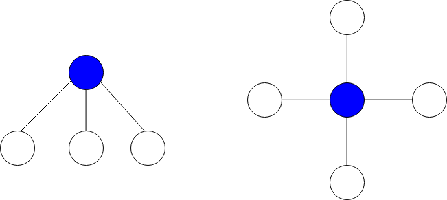

## 图中最大星和

给你一个 n 个点的无向图，节点从 0 到 n - 1 编号。给你一个长度为 n 下标从 0 开始的整数数组 vals ，其中 vals[i] 表示第 i 个节点的值。

同时给你一个二维整数数组 edges ，其中 edges[i] = [ai, bi] 表示节点 ai 和 bi 之间有一条双向边。

星图 是给定图中的一个子图，它包含一个中心节点和 0 个或更多个邻居。换言之，星图是给定图中一个边的子集，且这些边都有一个公共节点。

下图分别展示了有 3 个和 4 个邻居的星图，蓝色节点为中心节点。


星和 定义为星图中所有节点值的和。

给你一个整数 k ，请你返回 至多 包含 k 条边的星图中的 最大星和 。

```
impl Solution {
    pub fn max_star_sum(vals: Vec<i32>, edges: Vec<Vec<i32>>, k: i32) -> i32 {
        let n = vals.len();
        let k = k as usize;

        // 构建邻接表，存储邻居节点值
        let mut neighbors = vec![Vec::new(); n];
        for edge in edges {
            let (u, v) = (edge[0] as usize, edge[1] as usize);
            neighbors[u].push(vals[v]);
            neighbors[v].push(vals[u]);
        }

        let mut ans = i32::MIN;

        for i in 0..n {
            // 只需关注正数邻居值，负数不会增加星和
            // 对邻居值降序排序，取前 k 个正数
            let mut positive: Vec<i32> = neighbors[i]
                .iter()
                .filter(|&&val| val > 0)
                .copied()
                .collect();

            // 降序排序（正数部分按从大到小）
            positive.sort_unstable_by(|a, b| b.cmp(a));

            // 取前 k 个最大的正数邻居值
            let neighbor_sum: i32 = positive
                .iter()
                .take(k)
                .sum();

            // 星和 = 中心节点值 + 选中的正数邻居值之和
            let star_sum = vals[i] + neighbor_sum;
            ans = ans.max(star_sum);
        }

        ans
    }
}
```
