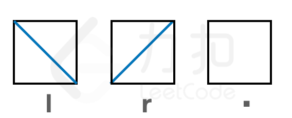

## 集水器

字符串数组 shape 描述了一个二维平面中的矩阵形式的集水器，shape[i][j] 表示集水器的第 i 行 j 列为：

· 'l'表示向左倾斜的隔板（即从左上到右下）；
· 'r'表示向右倾斜的隔板（即从左下到右上）；
· '.' 表示此位置没有隔板


已知当隔板构成存储容器可以存水，每个方格代表的蓄水量为 2。集水器初始浸泡在水中，除内部密闭空间外，所有位置均被水填满。 现将其从水中竖直向上取出，请返回集水器最终的蓄水量。

注意：

隔板具有良好的透气性，因此空气可以穿过隔板，但水无法穿过


```
struct DisjointSet {
    parent: Vec<usize>,
    rank: Vec<usize>,
}

impl DisjointSet {
    fn new(n: usize) -> Self {
        Self {
            parent: (0..n).collect(),
            rank: vec![0; n],
        }
    }

    fn find(&mut self, x: usize) -> usize {
        if self.parent[x] != x {
            self.parent[x] = self.find(self.parent[x]);
        }
        self.parent[x]
    }

    fn union(&mut self, a: usize, b: usize) {
        let ra = self.find(a);
        let rb = self.find(b);
        if ra == rb {
            return;
        }
        if self.rank[ra] < self.rank[rb] {
            self.parent[ra] = rb;
        } else if self.rank[ra] > self.rank[rb] {
            self.parent[rb] = ra;
        } else {
            self.parent[rb] = ra;
            self.rank[ra] += 1;
        }
    }

    fn connected(&mut self, a: usize, b: usize) -> bool {
        self.find(a) == self.find(b)
    }
}

impl Solution {
    pub fn reservoir(shape: Vec<String>) -> i32 {
        let m = shape.len();
        let n = shape[0].len();
        let total = m * n * 4;
        let g = |i: usize, j: usize, d: usize| i * n * 4 + j * 4 + d;
        // d: 0=左, 1=下, 2=右, 3=上

        // 解码函数，从节点id获取(i,j,d)
        let decode = |id: usize| {
            let i = id / (n * 4);
            let rem = id % (n * 4);
            let j = rem / 4;
            let d = rem % 4;
            (i, j, d)
        };

        let mut graph = vec![Vec::new(); total];
        let mut up = vec![false; total];
        let mut down = vec![false; total];
        let mut left = vec![false; total];
        let mut right = vec![false; total];

        // 步骤I：构建无向图
        for i in 0..m {
            let row = shape[i].as_bytes();
            for j in 0..n {
                // 水平相邻
                if j > 0 {
                    graph[g(i, j, 0)].push(g(i, j - 1, 2));
                } else {
                    left[g(i, j, 0)] = true;
                }
                if j < n - 1 {
                    graph[g(i, j, 2)].push(g(i, j + 1, 0));
                } else {
                    right[g(i, j, 2)] = true;
                }
                // 垂直相邻
                if i > 0 {
                    graph[g(i, j, 3)].push(g(i - 1, j, 1));
                } else {
                    up[g(i, j, 3)] = true;
                }
                if i < m - 1 {
                    graph[g(i, j, 1)].push(g(i + 1, j, 3));
                } else {
                    down[g(i, j, 1)] = true;
                }

                // 内部连接
                if row[j] != b'r' {
                    graph[g(i, j, 0)].push(g(i, j, 1));
                    graph[g(i, j, 1)].push(g(i, j, 0));
                    graph[g(i, j, 2)].push(g(i, j, 3));
                    graph[g(i, j, 3)].push(g(i, j, 2));
                }
                if row[j] != b'l' {
                    graph[g(i, j, 0)].push(g(i, j, 3));
                    graph[g(i, j, 3)].push(g(i, j, 0));
                    graph[g(i, j, 1)].push(g(i, j, 2));
                    graph[g(i, j, 2)].push(g(i, j, 1));
                }
            }
        }

        // 步骤II：判断初始有水的位置
        let mut djs = DisjointSet::new(total + 1);
        for u in 0..total {
            for &v in &graph[u] {
                djs.union(u, v);
            }
            if up[u] || down[u] || left[u] || right[u] {
                djs.union(u, total);
            }
        }
        let mut water = vec![false; total];
        for u in 0..total {
            water[u] = djs.connected(u, total);
        }

        // 步骤III：逐层处理，统计最终存水
        let mut ans = 0;
        for i in (0..m).rev() {
            let mut djs = DisjointSet::new(total + 1);
            // 加入所有边，但跳过与上一层（i-1）连接的向上边
            for u in 0..total {
                let (iu, ju, du) = decode(u);
                for &v in &graph[u] {
                    let (iv, jv, dv) = decode(v);
                    // 跳过向上的边：u是当前层的上区域且v是上一层的下区域
                    if iu == i && du == 3 && iv == i - 1 && dv == 1 {
                        continue;
                    }
                    // 反向边同样跳过
                    if iu == i - 1 && du == 1 && iv == i && dv == 3 {
                        continue;
                    }
                    djs.union(u, v);
                }
                if left[u] || right[u] || down[u] {
                    djs.union(u, total);
                }
            }

            // 统计本层中初始有水且不能流出的区域
            for j in 0..n {
                for d in 0..4 {
                    let u = g(i, j, d);
                    if water[u] && !djs.connected(u, total) {
                        ans += 1;
                    }
                }
            }
        }

        ans / 2
    }
}
```
