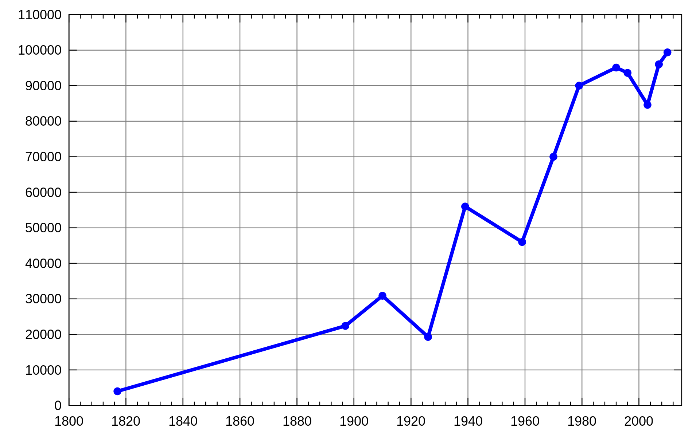

## 表示一个折线图的最少线段数

给你一个二维整数数组 stockPrices ，其中 stockPrices[i] = [dayi, pricei] 表示股票在 dayi 的价格为 pricei 。折线图 是一个二维平面上的若干个点组成的图，横坐标表示日期，纵坐标表示价格，折线图由相邻的点连接而成。比方说下图是一个例子：



请你返回要表示一个折线图所需要的 最少线段数 。

```
impl Solution {
    pub fn minimum_lines(mut stock_prices: Vec<Vec<i32>>) -> i32 {
        let n = stock_prices.len();

        // 少于3个点：0个点不需要线段，2个点需要1条线段
        if n <= 2 {
            return (n - 1) as i32;
        }

        // 按时间排序
        stock_prices.sort_unstable_by(|a, b| a[0].cmp(&b[0]));

        let mut lines = 1;

        // 检查每三个连续点是否共线
        for window in stock_prices.windows(3) {
            let (x1, y1) = (window[0][0], window[0][1]);
            let (x2, y2) = (window[1][0], window[1][1]);
            let (x3, y3) = (window[2][0], window[2][1]);

            // 使用叉积判断三点是否共线：(x2-x1)*(y3-y2) != (y2-y1)*(x3-x2)
            let cross_product = (x2 - x1) * (y3 - y2);
            let cross_product2 = (y2 - y1) * (x3 - x2);

            if cross_product != cross_product2 {
                lines += 1;
            }
        }

        lines
    }
}
```
