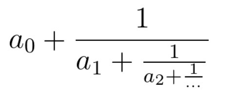

##  分式化简


有一个同学在学习分式。他需要将一个连分数化成最简分数，你能帮助他吗？



连分数是形如上图的分式。在本题中，所有系数都是大于等于0的整数。

输入的cont代表连分数的系数（cont[0]代表上图的a0，以此类推）。返回一个长度为2的数组[n, m]，使得连分数的值等于n / m，且n, m最大公约数为1。

```
impl Solution {
    /// 将连分数 cont 转换为最简分数，返回 [分子, 分母]
    /// 连分数 cont = [a0, a1, ..., an] 表示 a0 + 1/(a1 + 1/(...))
    pub fn fraction(cont: Vec<i32>) -> Vec<i32> {
        // 从最后一个系数开始迭代，初始值为 1/0? 不对，反向处理。
        // 从右向左：
        // 令初始分数为 0/1，对每个 a 迭代：新分数 = a + 1/(旧分数)
        let (mut num, mut den) = (0, 1);
        for &a in cont.iter().rev() {
            // 新分数 = a + 1/(num/den) = a + den/num = (a*num + den)/num
            // 但为了迭代方便，交换分子分母：新分数 = (a*num + den)/num
            // 所以迭代公式：num, den = den, a*den + num? 需要推导。
            // 原 Python 写法：n,m = m, m*a+n。其中 n/m 表示当前分数（从右往左）。
            // 初始 n=0,m=1 表示 0/1。遇到 a 时，新分数 = a + 1/(n/m) = a + m/n = (a*n + m)/n。
            // 所以新分子 = m，新分母 = a*m + n。即 n=m, m=a*m+n。
            // 验证：cont=[a0]：n=1, m=a0，最终分数 = m/n = a0/1 正确。
            // 因此 Rust 中：
            let new_num = den;
            let new_den = den * a + num;
            num = new_num;
            den = new_den;
        }
        // 最终分数为 den/num（因为迭代结束时 den 是分子，num 是分母）
        vec![den, num]
    }
}
```
