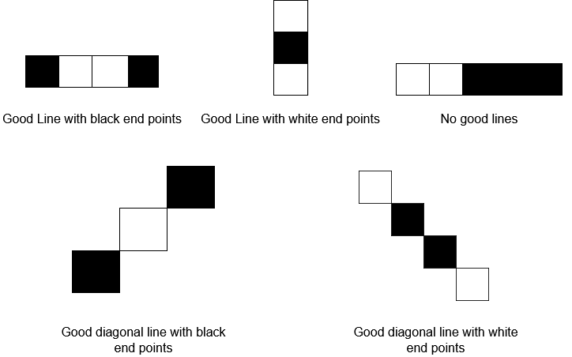

## 检查操作是否合法


给你一个下标从 0 开始的 8 x 8 网格 board ，其中 board[r][c] 表示游戏棋盘上的格子 (r, c) 。棋盘上空格用 '.' 表示，白色格子用 'W' 表示，黑色格子用 'B' 表示。

游戏中每次操作步骤为：选择一个空格子，将它变成你正在执行的颜色（要么白色，要么黑色）。但是，合法 操作必须满足：涂色后这个格子是 好线段的一个端点 （好线段可以是水平的，竖直的或者是对角线）。

好线段 指的是一个包含 三个或者更多格子（包含端点格子）的线段，线段两个端点格子为 同一种颜色 ，且中间剩余格子的颜色都为 另一种颜色 （线段上不能有任何空格子）。你可以在下图找到好线段的例子：


给你两个整数 rMove 和 cMove 以及一个字符 color ，表示你正在执行操作的颜色（白或者黑），如果将格子 (rMove, cMove) 变成颜色 color 后，是一个 合法 操作，那么返回 true ，如果不是合法操作返回 false 。

```
impl Solution {
    /// 判断将 (rMove, cMove) 涂成 color 后是否为合法操作。
    /// 合法条件：该格子成为某个好线段的一个端点。
    /// 好线段：长度 >= 3，两端同色，中间全为另一种颜色，无空格。
    pub fn check_move(board: Vec<Vec<char>>, r_move: i32, c_move: i32, color: char) -> bool {
        // 辅助函数：检查从 (r_move, c_move) 沿 (dx, dy) 方向是否存在好线段
        fn check_direction(
            board: &Vec<Vec<char>>,
            r_move: i32,
            c_move: i32,
            dx: i32,
            dy: i32,
            color: char
        ) -> bool {
            // 从起点沿方向移动一步
            let mut row = r_move + dx;
            let mut col = c_move + dy;
            let mut step = 1; // 当前遍历到的节点序号（起点为 0）

            // 沿该方向遍历
            while row >= 0 && row < 8 && col >= 0 && col < 8 {
                let current = board[row as usize][col as usize];

                if step == 1 {
                    // 第一个点必须为相反颜色
                    if current == '.' || current == color {
                        return false;
                    }
                } else {
                    // 好线段中不能有空格
                    if current == '.' {
                        return false;
                    }
                    // 如果遇到目标颜色，说明到达好线段的终点
                    if current == color {
                        return true;
                    }
                }

                // 继续沿该方向前进
                step += 1;
                row += dx;
                col += dy;
            }

            // 该方向未找到好线段
            false
        }

        // 8 个方向：(行偏移, 列偏移)
        // 顺序：右、右下、下、左下、左、左上、上、右上
        let dx = [1, 1, 0, -1, -1, -1, 0, 1];
        let dy = [0, 1, 1, 1, 0, -1, -1, -1];

        // 遍历所有方向，只要有一个方向存在好线段即返回 true
        for (&dx, &dy) in dx.iter().zip(dy.iter()) {
            if check_direction(&board, r_move, c_move, dx, dy, color) {
                return true;
            }
        }

        false
    }
}
```
