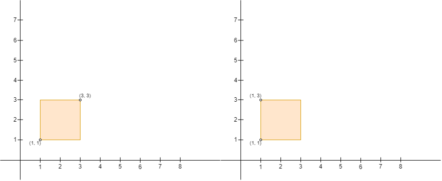

## 人员站位的方案数 II

给你一个  n x 2 的二维数组 points ，它表示二维平面上的一些点坐标，其中 points[i] = [xi, yi] 。

我们定义 x 轴的正方向为 右 （x 轴递增的方向），x 轴的负方向为 左 （x 轴递减的方向）。类似的，我们定义 y 轴的正方向为 上 （y 轴递增的方向），y 轴的负方向为 下 （y 轴递减的方向）。

你需要安排这 n 个人的站位，这 n 个人中包括 Alice 和 Bob 。你需要确保每个点处 恰好 有 一个 人。同时，Alice 想跟 Bob 单独玩耍，所以 Alice 会以 Alice 的坐标为 左上角 ，Bob 的坐标为 右下角 建立一个矩形的围栏（注意，围栏可能 不 包含任何区域，也就是说围栏可能是一条线段）。如果围栏的 内部 或者 边缘 上有任何其他人，Alice 都会难过。

请你在确保 Alice 不会 难过的前提下，返回 Alice 和 Bob 可以选择的 点对 数目。

注意，Alice 建立的围栏必须确保 Alice 的位置是矩形的左上角，Bob 的位置是矩形的右下角。比方说，以 (1, 1) ，(1, 3) ，(3, 1) 和 (3, 3) 为矩形的四个角，给定下图的两个输入，Alice 都不能建立围栏，原因如下：

图一中，Alice 在 (3, 3) 且 Bob 在 (1, 1) ，Alice 的位置不是左上角且 Bob 的位置不是右下角。
图二中，Alice 在 (1, 3) 且 Bob 在 (1, 1)（如图所示，用矩形代替线条），Bob 的位置不是在围栏的右下角。




```
impl Solution {
    pub fn number_of_pairs(mut points: Vec<Vec<i32>>) -> i32 {
        // 按 x 升序，x 相同时按 y 降序排序
        // 这样保证对于每个点，后续点都在其右下方或右侧
        points.sort_unstable_by_key(|p| (p[0], -p[1]));

        let mut ans = 0;
        let n = points.len();

        for i in 0..n {
            let (x1, y1) = (points[i][0], points[i][1]);
            let mut max_y = i32::MIN;

            // 只检查 x 坐标大于等于当前点的点（已经在排序中保证）
            for j in i + 1..n {
                let (x2, y2) = (points[j][0], points[j][1]);

                // Alice 在左上 (x1,y1)，Bob 在右下 (x2,y2)
                // 需要满足：x1 <= x2 且 y1 >= y2
                if x2 < x1 || y2 > y1 {
                    continue;
                }

                // 检查该矩形内是否有其他点
                // 按 y 降序排序后，当前点 (x2,y2) 的 y 值必须大于之前所有候选点的 y 值
                // 这样保证矩形内部没有其他点（因为如果有，它的 y 值会在 y2 和 y1 之间）
                if y2 > max_y {
                    max_y = y2;
                    ans += 1;
                }

                // 如果已经达到上边界，不可能再有更大的 y2 了（因为 y2 是降序）
                if max_y == y1 {
                    break;
                }
            }
        }

        ans
    }
}
```
