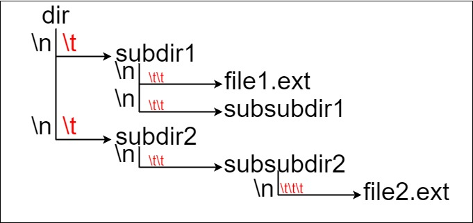

## 文件的最长绝对路径

假设有一个同时存储文件和目录的文件系统。下图展示了文件系统的一个示例：



这里将 dir 作为根目录中的唯一目录。dir 包含两个子目录 subdir1 和 subdir2 。subdir1 包含文件 file1.ext 和子目录 subsubdir1；subdir2 包含子目录 subsubdir2，该子目录下包含文件 file2.ext 。

在文本格式中，如下所示(⟶表示制表符)：

```
dir
⟶ subdir1
⟶ ⟶ file1.ext
⟶ ⟶ subsubdir1
⟶ subdir2
⟶ ⟶ subsubdir2
⟶ ⟶ ⟶ file2.ext
```

如果是代码表示，上面的文件系统可以写为 "dir\n\tsubdir1\n\t\tfile1.ext\n\t\tsubsubdir1\n\tsubdir2\n\t\tsubsubdir2\n\t\t\tfile2.ext" 。'\n' 和 '\t' 分别是换行符和制表符。

文件系统中的每个文件和文件夹都有一个唯一的 绝对路径 ，即必须打开才能到达文件/目录所在位置的目录顺序，所有路径用 '/' 连接。上面例子中，指向 file2.ext 的 绝对路径 是 "dir/subdir2/subsubdir2/file2.ext" 。每个目录名由字母、数字和/或空格组成，每个文件名遵循 name.extension 的格式，其中 name 和 extension由字母、数字和/或空格组成。

给定一个以上述格式表示文件系统的字符串 input ，返回文件系统中 指向 文件 的 最长绝对路径 的长度 。 如果系统中没有文件，返回 0。

```
// 计算最长文件路径长度
// 使用层级栈：每层存储该级路径长度，遇到文件时计算完整路径长度
impl Solution {
    pub fn length_longest_path(input: String) -> i32 {
        let mut path_lengths = vec![0]; // 栈底为0，便于计算总长度
        let mut max_len = 0;

        for line in input.split('\n') {
            // 计算当前层级（制表符数量）
            let tabs = line.chars().take_while(|&c| c == '\t').count();
            let name = &line[tabs..];
            let name_len = name.len();

            // 更新栈：保持当前层级深度
            path_lengths.truncate(tabs + 1);

            // 当前路径总长度 = 父级路径长度 + 当前名称长度 + 路径分隔符
            let current_len = path_lengths[tabs] + name_len + 1;

            // 检查是否为文件（包含扩展名）
            if name.contains('.') {
                // 减去根目录的额外分隔符（路径长度 = 总长度 - 1）
                max_len = max_len.max(current_len - 1);
            } else {
                // 目录：保存当前路径长度供子级使用
                if tabs + 1 < path_lengths.len() {
                    path_lengths[tabs + 1] = current_len;
                } else {
                    path_lengths.push(current_len);
                }
            }
        }

        max_len as i32
    }
}
```
