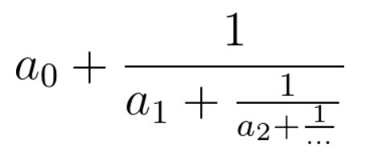

## 分式化简

有一个同学在学习分式。他需要将一个连分数化成最简分数，你能帮助他吗？


连分数是形如上图的分式。在本题中，所有系数都是大于等于0的整数。

输入的cont代表连分数的系数（cont[0]代表上图的a0，以此类推）。返回一个长度为2的数组[n, m]，使得连分数的值等于n / m，且n, m最大公约数为1。


C++
```
class Solution {
public:
    vector<int> fraction(vector<int>& cont) {
        reverse(cont.begin(), cont.end());
        // 初始值：a[1] + 1 / a[0]
        int c = 1, d = cont[0];
        int n = cont.size();
        for(int i = 1; i < n; i++) {
            // a[i] + c / d = (a[i] * d + c) / d
            int new_c = cont[i] * d + c;
            int new_d = d;

            // 化简最简分数
            int g = gcd(new_c, new_d);
            new_c /= g;
            new_d /= g;

            // 取倒数，赋值给新的 c / d
            c = new_d;
            d = new_c;
        }

        // 最后一轮，没有取倒数这一步
        swap(c, d);

        return vector<int>{c, d};

    }
};
```


Rust
```
impl Solution {
    /// 将连分数化为最简分数 [n, m]
    pub fn fraction(cont: Vec<i32>) -> Vec<i32> {
        let mut num = 1i64;
        let mut den = cont[cont.len() - 1] as i64;

        for &a in cont[..cont.len() - 1].iter().rev() {
            num += a as i64 * den;
            let g = gcd(num, den);
            num /= g;
            den /= g;
            std::mem::swap(&mut num, &mut den);
        }

        std::mem::swap(&mut num, &mut den);
        vec![num as i32, den as i32]
    }
}

fn gcd(mut a: i64, mut b: i64) -> i64 {
    while b != 0 {
        (a, b) = (b, a % b);
    }
    a
}
```
