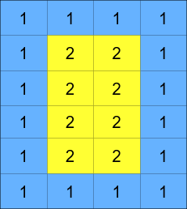
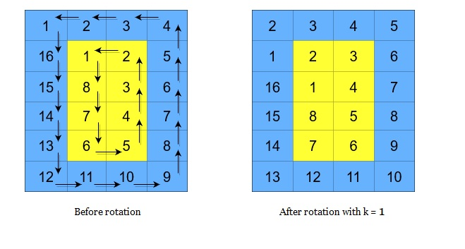

## 循环轮转矩阵

给你一个大小为 m x n 的整数矩阵 grid​​​ ，其中 m 和 n 都是 偶数 ；另给你一个整数 k 。

矩阵由若干层组成，如下图所示，每种颜色代表一层：


矩阵的循环轮转是通过分别循环轮转矩阵中的每一层完成的。在对某一层进行一次循环旋转操作时，层中的每一个元素将会取代其 逆时针 方向的相邻元素。轮转示例如下：


返回执行 k 次循环轮转操作后的矩阵。


```
impl Solution {
    pub fn rotate_grid(mut grid: Vec<Vec<i32>>, k: i32) -> Vec<Vec<i32>> {
        let (m, n) = (grid.len(), grid[0].len());
        let layers = m.min(n) / 2;

        for layer in 0..layers {
            let (t, l) = (layer, layer);
            let (b, r) = (m - 1 - layer, n - 1 - layer);

            // 提取：顶(左->右) -> 右(上->下) -> 底(右->左) -> 左(下->上)
            let mut ring = vec![];
            for c in l..r { ring.push(grid[t][c]); }
            for row in t..b { ring.push(grid[row][r]); }
            for c in (l + 1..=r).rev() { ring.push(grid[b][c]); }
            for row in (t + 1..=b).rev() { ring.push(grid[row][l]); }

            let offset = (k as usize) % ring.len();
            if offset > 0 {
                ring.rotate_left(offset);
                let mut it = ring.into_iter();
                for c in l..r { grid[t][c] = it.next().unwrap(); }
                for row in t..b { grid[row][r] = it.next().unwrap(); }
                for c in (l + 1..=r).rev() { grid[b][c] = it.next().unwrap(); }
                for row in (t + 1..=b).rev() { grid[row][l] = it.next().unwrap(); }
            }
        }

        grid
    }
}
```
