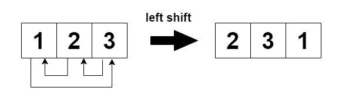
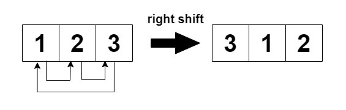

## 循环移位后的矩阵相似检查

给你一个下标从 0 开始且大小为 m x n 的整数矩阵 mat 和一个整数 k 。矩阵行的下标是从 0 开始的。

进行下面操作 k 次：

偶数行（0, 2, 4, ...）循环向左移动。


奇数行（1, 3, 5, ...）循环向右移动。


如果经过 k 步后的最终修改矩阵与原始矩阵相同，则返回 true，否则返回 false。

```
impl Solution {
    pub fn are_similar(mat: Vec<Vec<i32>>, k: i32) -> bool {
        let n = mat[0].len();
        let k = (k as usize) % n;

        // k 是 n 的倍数时，任何矩阵移动后都不变
        if k == 0 {
            return true;
        }

        for row in &mat {
            for (j, &val) in row.iter().enumerate() {
                // 偶数行左移 k、奇数行右移 k 后，与原始矩阵相同的充要条件都是：
                // 每个元素等于其前方第 k 个元素（循环意义上）
                if val != row[(j + k) % n] {
                    return false;
                }
            }
        }

        true
    }
}
```
