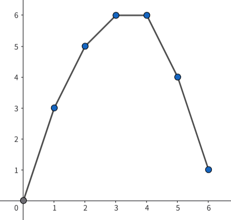
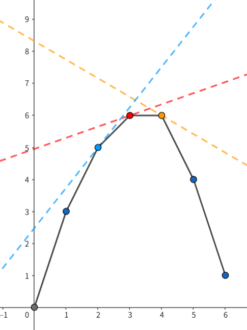
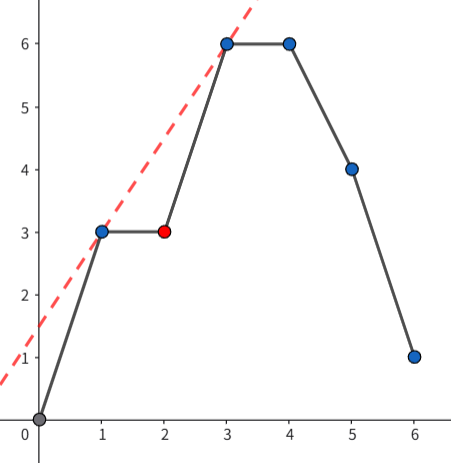

## M 个非重叠子数组最大和 II

给你一个长度为 n 的整数数组 nums，以及三个整数 m、l 和 r。

你的任务是从 nums 中选择 至少 一个且 至多 m 个 互不重叠的子数组，并满足：

每个被选择的 子数组 的长度都在 [l, r] 范围内（包含两端）。

所有被选择 子数组 的总和 最大 。

返回你能够取得的 最大 总和。

子数组 是数组中一个连续的 非空 元素序列。


C++
```
class Solution {
public:
    long long maximumSum(vector<int>& nums, int m, int l, int r) {
        int n = nums.size();

        // ============================================================
        // 1. 构建前缀和数组
        // ============================================================
        // g[i] 表示前 i 个元素的和（i 从 0 到 n）
        long long g[n + 1];
        g[0] = 0;
        for (int i = 1; i <= n; i++) {
            g[i] = g[i - 1] + nums[i - 1];
        }

        const long long INF = 1e18;
        using PII = pair<long long, int>; // (收益, 子数组数量)

        // ============================================================
        // 2. 带惩罚值的 DP 检查函数
        // ============================================================
        // 给定惩罚值 penalty，计算：
        //   - 最大带惩罚收益（总收益 - penalty * 子数组数量）
        //   - 达到该最大收益时使用的子数组数量（取最小值）
        // ============================================================
        auto check = [&](long long penalty) -> PII {
            // f[i]：前 i 个元素中的最优状态
            // f[i].first  = 最大带惩罚收益
            // f[i].second = 达到该收益时使用的子数组数量（取较小值，用负数存储便于比较）
            PII f[n + 1];
            f[0] = {0, 0}; // 前 0 个元素，收益 0，段数 0

            PII best = {-INF, 0}; // 全局最优（至少选 1 段）

            // 单调队列，存储候选起点信息：
            // [ value = f[j].first - g[j], count = -f[j].second, index = j ]
            // 其中 value 越大越好，count 越小越好（用负数表示方便比较）
            deque<array<long long, 3>> dq;

            // ptr：下一个待加入队列的起点索引
            for (int i = 1, ptr = 0; i <= n; i++) {
                // ----------------------------------------------------
                // 步骤1：移除超出长度限制 r 的过期起点
                // ----------------------------------------------------
                // 起点 j 必须满足：i - j <= r  =>  j >= i - r
                while (!dq.empty() && i - dq.front()[2] > r) {
                    dq.pop_front();
                }

                // ----------------------------------------------------
                // 步骤2：将新候选起点加入队列
                // ----------------------------------------------------
                // 起点 j 必须满足：i - j >= l  =>  j <= i - l
                while (i - ptr >= l) {
                    // 候选值 = f[ptr].first - g[ptr]
                    // 段数取负数，使得比较时值越小表示段数越少
                    array<long long, 3> candidate = {
                        f[ptr].first - g[ptr],
                        f[ptr].second, // 已经是负数
                        ptr
                    };

                    // 维护单调递减队列（按候选值降序，值相同则段数少优先）
                    while (!dq.empty() && dq.back() <= candidate) {
                        dq.pop_back();
                    }
                    dq.push_back(candidate);
                    ptr++;
                }

                // ----------------------------------------------------
                // 步骤3：计算 f[i]
                // ----------------------------------------------------
                // 情况 A：最后一个子数组不以 i 结尾（不选 nums[i]）
                f[i] = f[i - 1];

                // 情况 B：最后一个子数组以 i 结尾
                if (!dq.empty()) {
                    // 从队首取出最优起点 j
                    // 收益 = g[i] + max(f[j].first - g[j]) - penalty
                    // 段数 = f[j].second + 1（f[j].second 为负数，所以用 -1）
                    PII take = {
                        dq.front()[0] + g[i] - penalty,
                        dq.front()[1] - 1 // 负数加 1 表示段数加 1
                    };

                    // 更新全局最优（至少选 1 段）
                    best = max(best, take);
                    // 更新 f[i]
                    f[i] = max(f[i], take);
                }
            }

            return best;
        };

        // ============================================================
        // 3. 尝试无惩罚值的情况
        // ============================================================
        auto result = check(0);
        if (-result.second <= m) {
            // 无惩罚时最优方案段数已经不超过 m，直接返回
            return result.first;
        }

        // ============================================================
        // 4. WQS 二分：寻找合适的惩罚值
        // ============================================================
        // 二分惩罚值 penalty，使得最优方案段数 <= m
        // penalty 越大，段数越少；penalty 越小，段数越多
        long long low = -2e10, high = 2e10;
        while (low < high) {
            long long mid = (low + high) >> 1;
            auto res = check(mid);
            if (-res.second <= m) {
                // 段数足够少，惩罚值可以更大（或更小？这里取更小方向）
                high = mid;
            } else {
                low = mid + 1;
            }
        }

        // ============================================================
        // 5. 还原真实答案
        // ============================================================
        // 在惩罚值为 low 时，最优带惩罚收益为 p.first
        // 真实收益 = 带惩罚收益 + low * m（补偿惩罚扣掉的部分）
        auto final_result = check(low);
        return final_result.first + m * low;
    }
};
```


题解


### 解法：WQS 二分

本题应该是力扣第一次出现必须使用 WQS 二分解决的问题，因此我们首先对 WQS 二分进行介绍。读者也可以参考 zerotrac 的题解 学习该算法。

### WQS 二分可以解决什么问题

WQS（王钦石）二分，国际上称为 Aliens Trick，通常用于解决这样一类优化问题：选出恰好 m 个物品，使得收益最大。但想要用 WQS 二分解决，问题必须具有以下两个额外特性：

· 如果无视数量限制，能有一个复杂度比较低的算法 A。也就是说“求选出任意数量的物品，使得收益最大”的复杂度要比较低。
· 答案是关于 m 的凸函数。感性理解，就是选择新物品的收益越来越小。

假设算法 A 的复杂度为 O(T)，那么 WQS 二分可以让我们用 O(TlogW) 的复杂度解出带数量限制的原问题。W 与问题值域有关，具体的计算在下文阐述。

### WQS 二分的具体思想

以本题的简化版举例：给定一个序列，从中选出 恰好 m 个互不相交的子数组（长度不限），使得子数组之和最大。比如说，给定序列 [4,3,−10,2,−3,5,1]，从中选出恰好 2 个子数组，使得子数组之和最大。答案应该是 (4+3)+(5+1)=13。

假设我们无视这个数量限制，可以选择任意个互不相交的子数组，使得子数组之和最大。那么最优答案应该是 (4+3)+2+(5+1)=15，选择 3>2 个子数组，怎么办呢？

WQS 二分通过引入一个惩罚值 λ，每选一个子数组都要额外付出 λ 的代价，来调整算法 A 所选物品的数量。只要调整 λ，让算法 A 所选物品的数量恰为 m，我们就得到了原问题的解。

比如说，我们引入惩罚值 λ=3，每选一个子数组要额外扣 3 分。那么选择 3 个子数组的最大和就是 15−3×3=6，而选择 2 个子数组的最大和就变成了 13−2×3=7。这样我们无视数量限制的算法就会求出 7 作为答案，返回最终答案时，再将惩罚值 2×3 还回去，返回 7+2×3=13 作为答案即可。

可是这个 λ 应该取多少才合适呢？这就是需要我们二分的部分。直观感受上，如果 λ 太大了，算法 A 选的物品数就会偏少；λ 太小了，选的物品数就会偏多。所以我们可以根据算法 A 选了几个物品，来决定到底是调大还是调小 λ，最终精准锁定目标物品数。

```
while (head < tail) {
    int mid = (head + tail) / 2;
    // 求惩罚值为 mid 时，算法 A 求出的最大价值 val 以及所选物品数 cnt
    auto &[val, cnt] = check(mid);
    // 选的物品数太多了，调大惩罚值
    if (cnt > m) head = mid + 1;
    else tail = mid;
}

auto &[val, cnt] = check(head);
// 最终答案要把惩罚值还回去
return val + m * head;
```

### WQS 二分的正确性

为什么调整惩罚值 λ，就一定能让算法 A 选出我们想要的物品数量呢？从 WQS 二分的几何意义就能看出。下图是没有惩罚值的情况下，所选物品数量（横轴）与最大收益（纵轴）的函数图 f(x)。根据额外特性的限制，它必须是一个凸函数。



算上惩罚值以后，选 x 个物品的总收益变成了 f(x)−λx。这个值是什么意思呢？其实它刚好就是经过点 (x,f(x))，且斜率为 λ 的直线与 y 轴的交点（截距）。

过哪个点才能让截距最大呢？我们想象一条斜率为 λ 的直线从上往下移，直到第一次碰上凸函数。这时候碰上的点，就是让截距最大的点。

从下图可以看出，斜率 λ 越小，第一次碰到的点的 x 坐标就越大，和上一节“λ 太小了，选的物品数就会偏多”的直观感受一致。



而且，由于 f(x) 是凸函数，所以对于每个 x，总是存在一个斜率 λ，使得 x 是让截距最大的点的横坐标。具体来说，假设凸壳上 x 的上一个横坐标是 x'，那么只要取 λ=(f(x)-f(x'))/(x-x')即可。如果 x 是第一个点，那么把下一个点的横坐标作为 x'也可以。

这里就能看出凸函数这个限制为什么这么重要了。如果 f(x) 不是凸的，比如下面这张图，那么无论直线的斜率是多少，第一次碰到的点的横坐标都不可能是 2。

所以，WQS 二分题的难点往往不在于算法本身，而是在于证明为什么能用 WQS 二分做，也就是证明答案的凸性。



### WQS 二分的细节

二分的上下界是多少？

从 WQS 二分的几何意义可以看出，二分的上下界，其实就是凸壳上的最小和最大斜率。因为超出这个斜率范围外的直线，碰到的肯定是第一个点或最后一个点。

二分的上下界应该是整数还是浮点数？

就看凸壳上的线段斜率是整数还是浮点数。

### 回到本题

本题相比 WQS 二分的模板题，有一个小变化：求的是 至多 选择 m 个子数组时的最大收益。应该怎么把“恰好”变成“至多”呢？

我们还是从无视数量限制的问题出发。如果算法 A 告诉我们，在可以选择任意多个子数组的情况下，只要选 m'≤m 个子数组就是最优的，那这就是答案，不用 WQS 二分了。

如果要选 m'>m 个子数组才是最优的，也就是说这个凸函数的顶点在 x=m'处取到，那么 1≤x≤m 完全位于凸函数的左半边，函数值是单调递增的，那么在数量的限制下，恰好选择 m 个子数组就是最优解。

经过上述分类讨论，我们就把“至多”改回了“恰好”。

本题凸函数的斜率，就是选择一个子数组最多增加/减少的总和，即 nV。其中 1 ≤ n ≤ 10^5, -10^5 ≤ V ≤ 10^5 是元素的值域。所以二分上下界取 ±10^10即可。

还剩下两个问题。

### 无视数量限制的问题该怎么解？

和 非重叠子数组最大和I 类似，维护 f(i) 表示从前 i 个元素中选择任意个子数组的最大和，同样使用单调队列优化 DP 即可在 O(n) 的复杂度内求出。详见 我的题解。

因此，本题的整体复杂度为 O(nlog(nV))。

### 怎么证明答案的凸性？

这个证明非常巧妙，我觉得比这道题本身有意思得多，详见文末。

对于参赛选手而言，其实不需要严格证明答案的凸性。只要和平方级的算法对拍一下，如果能拍得上，一般 WQS 二分就是正确的。

本题的代码实现在 break the tie 方面有一定细节，请读者阅读参考代码的注释，并仔细思考里面提出的问题。

参考代码（c++）
```
class Solution {
public:
    long long maximumSum(vector<int>& nums, int m, int l, int r) {
        int n = nums.size();

        // 求前缀和
        long long g[n + 1];
        g[0] = 0;
        for (int i = 1; i <= n; i++) g[i] = g[i - 1] + nums[i - 1];

        const long long INF = 1e18;
        typedef pair<long long, int> pli;
        // 求惩罚值为 cost 的情况下，得到的最大总收益，以及选了几个子数组
        auto check = [&](long long cost) {
            // f[i] = {前 i 个元素中选择任意个子数组的最大总收益, -1 * 选了几个子数组}
            // 这里子数组数量乘以 -1，是为了方便下面用 max 来求较小值，因为我们想在总收益相同的情况下，尽量少选子数组
            // 如果改成尽量多选子数组，下面的二分需要做出一些改变
            pli f[n + 1];
            f[0] = {0, 0};

            pli ret = {-INF, 0};
            // 单调队列求滑动窗口里 f[i] - g[i] 的最大值
            deque<array<long long, 3>> dq;
            // ptr 是即将加入滑动窗口的下标
            for (int i = 1, ptr = 0; i <= n; i++) {
                // 把单调队列里超出范围的元素都踢掉
                while (!dq.empty() && i - dq.front()[2] > r) dq.pop_front();
                // 将新元素加入单调队列
                while (i - ptr >= l) {
                    array<long long, 3> arr = {f[ptr].first - g[ptr], f[ptr].second, ptr};
                    while (!dq.empty() && dq.back() <= arr) dq.pop_back();
                    dq.push_back(arr);
                    ptr++;
                }

                // 最后一个子数组的右端点不为 i 的情况
                f[i] = f[i - 1];
                if (!dq.empty()) {
                    // 最后一个子数组的右端点为 i 的情况
                    // 直接从单调队列里取出 f[i'] - g[i'] 的最大值
                    // 别忘了每选一个子数组，都要额外付出 cost 的代价
                    pli p = {dq.front()[0] + g[i] - cost, dq.front()[1] - 1};
                    // 这里才更新 ret，因为至少要选 1 个子数组
                    ret = max(ret, p);
                    f[i] = max(f[i], p);
                }
            }
            return ret;
        };

        // 先看看没有惩罚值的最优解是不是直接满足条件
        auto p = check(0);
        if (-p.second <= m) return p.first;

        // WQS 二分求恰好选 m 个子数组的最大总收益
        // 找的是 check 选出不超过 m 个子数组的情况下，最大的惩罚值
        // 如果 check 里面改成尽量多选子数组，这里就要改成选出至少 m 个子数组的情况下，最小的惩罚值
        // 请读者思考：为什么？
        long long head = -2e10, tail = 2e10;
        while (head < tail) {
            long long mid = (head + tail) >> 1;
            auto p = check(mid);
            if (-p.second <= m) tail = mid;
            else head = mid + 1;
        }

        // 把惩罚值还回去，返回答案
        // 请读者思考：为什么不是返回 p.first - p.second * head？
        p = check(head);
        return p.first + m * head;
    }
};
```

### 不会做怎么办

本题应该是力扣第一次出现必须使用 WQS 二分解决的问题，可以作为 WQS 二分的模板题学习。顺便感慨一下力扣已经进化到这样的地步了。

### 凸性证明

接下来证明本题的凸性。也就是说，令 f(x) 表示恰好选择 x 个子数组的最大收益，那么 f(x−1)+f(x+1)≤2f(x)。

以下证明借鉴了 ABC383G 题解 的证明思路。

### 总体思路：交换论证

假设我们有两套最优方案：

方案 A：选择 (x−1) 个子数组的最优方案，权值和为 f(x−1)。
方案 B：选择 (x+1) 个子数组的最优方案，权值和为 f(x+1)。

我们要把 A 和 B 拆开，重新组合成两套新的方案 C 和 D，使得：

C 和 D 中各包含 x 个互不相交的子数组。
C 和 D 的总权值恰好等于 A 和 B 的总权值，即 (f(x−1)+f(x+1))。

为什么这样就能证明呢？因为 C 和 D 都是选择 x 个子数组的方案，它们的权值自然不超过选择 x 个子数组的 最优 方案的权值 f(x)。

也就是说，令 w(C) 和 w(D) 分别表示方案 C 和 D 的权值，有 f(x−1)+f(x+1)=w(C)+w(D)≤f(x)+f(x)=2f(x)，这就是我们要证明的不等式。

下面我们就来构造方案 C 和 D。

### 拆分端点再组合

我们把子数组看成一个左开右闭的区间 (si,ei]。方案 A 有 (x−1) 个子数组，即 (x−1) 个左右端点。方案 B 有 (x+1) 个子数组，即 (x+1) 个左右端点。即一共有 2x 个左端点和 2x 个右端点。

第一步，我们把所有 2x 个左端点从小到大排好，记为 s1 ≤ s2 ≤ ... ≤ s2x。

第二步，再把 2x 个右端点也从小到大排好，记为 e1 ≤ e2 ≤ ... ≤ e2x。注意，左右端点是 分别排序 的，互不干扰。

第三步，第 i 小的左端点，匹配第 i 小的右端点，得到 2x 个新区间 T1 = (s1,e1], T2 = (s2,e2], ..., T2x = (s2x,e2x]。

第四步，按编号奇偶分成两堆：

方案 C：T1, T3, ..., T2x-1。
方案 D：T2, T4, ..., T2x。

剩下的事情就是要证明：

· 每个 Ti 的长度在 [l,r] 范围内。
· 总权值不变。
· 方案 C（以及方案 D）内部的区间互不相交。

### 引理 1：每个 Ti 的长度在 [l,r] 范围内
我们要证明 l ≤ ei-si ≤ r。

对于 ei >= si+l，我们使用反证法，假设 ei < si+l。

我们看 e1 ≤ e2 ≤ ⋯ ≤ ei 这 i 个右端点在方案 A 和 B 中 原本所属的子数组。这些子数组的长度都至少为 l，因此它们的左端点都满足 左端点 <= 右端点 - l <= e_i - l < s_i + l - l = s_i。也就是说，我们找到了 i 个左端点满足 左端点 < s_i。

可是，si 作为第 i 小的左端点，最多只能有 (i−1) 个左端点比它小，产生了矛盾。反证法证明完毕。

接下来证明 si ≥ei−r，我们使用类似的反证法，假设 si < ei−r。

类似地，我们看 s1 ≤s2 ≤ ⋯ ≤ si 这 i 个左端点在方案 A 和 B 中 原本所属的子数组。这些子数组的长度都至多为 r，因此它们的右端点都满足 右端点 <= 左端点 + r <= s_i + r < e_i - r + r = e_i。也就是说，我们找到了 i 个右端点满足 右端点 < e_i。

可是，ei作为第 i 小的右端点，最多只能有 (i−1) 个右端点比它小，产生了矛盾。反证法证明完毕。

### 引理 2：总权值不变

设 g(i) 表示前 i 个元素的前缀和，那么原本单个区间 (p,q] 的权值，就是 g(q)−g(p)。原本所有区间的权值之和，就是q∑g(q)−p∑g(p)。

我们没有改变任何端点的值，只是把它们重新分配了一下。因此，所有新区间的权值之和，仍然是q∑g(q)−p∑g(p)。

### 引理 3：新方案内部的区间互不相交

对于每个格子 c，令 h(c) 表示有几个区间盖住了它。

和引理 2 的证明类似，格子 c 被盖住的数量 h(c)，等于 (左端点 < c 的数量) - (右端点 < c 的数量)。

对于原来的方案 A 和 B，因为原方案内部的区间互不相交，所以每个格子最多被覆盖两次，即 h(c)≤2。

对于新方案 C 和 D，我们没有改变任何端点的值，只是把它们重新分配了一下。因此对于每个格子 c，(左端点 < c 的数量) 和 (右端点 < c 的数量) 都没有变化，所以仍然有 h(c)≤2。

现在通过反证法，证明新方案内部的区间互不相交。取三个区间 Ti−1，Ti和 Ti+1，由于 h(c)≤2，不存在一个格子同时被这三个区间覆盖。

假设 Ti−1和 Ti+1相交，那么有 ei−1>si+1。由于 ei≥ei−1，所以也有 ei>si+1，再加上 si≤si+1，因此 Ti和 Ti+1也相交，这与“不存在一个格子同时被这三个区间覆盖”矛盾。

### 总结

我们通过左右端点的分别拆分，重新分配出了方案 C 和方案 D，并通过三个引理证明了两个方案的合法性。证毕。

作者：TsReaper
链接：https://leetcode.cn/problems/maximum-sum-of-m-non-overlapping-subarrays-ii/solutions/3980653/wqs-er-fen-jiao-cheng-yi-ji-ben-ti-de-tu-n8wq/
来源：力扣（LeetCode）
著作权归作者所有。商业转载请联系作者获得授权，非商业转载请注明出处。
