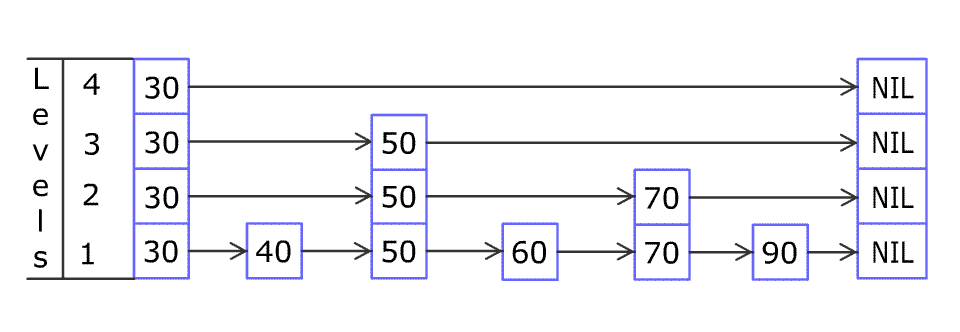

## 设计跳表

不使用任何库函数，设计一个 跳表 。

跳表 是在 O(log(n)) 时间内完成增加、删除、搜索操作的数据结构。跳表相比于树堆与红黑树，其功能与性能相当，并且跳表的代码长度相较下更短，其设计思想与链表相似。

例如，一个跳表包含 [30, 40, 50, 60, 70, 90] ，然后增加 80、45 到跳表中，以下图的方式操作：

跳表中有很多层，每一层是一个短的链表。在第一层的作用下，增加、删除和搜索操作的时间复杂度不超过 O(n)。跳表的每一个操作的平均时间复杂度是 O(log(n))，空间复杂度是 O(n)。


了解更多 : https://oi-wiki.org/ds/skiplist/

在本题中，你的设计应该要包含这些函数：

bool search(int target) : 返回target是否存在于跳表中。
void add(int num): 插入一个元素到跳表。
bool erase(int num): 在跳表中删除一个值，如果 num 不存在，直接返回false. 如果存在多个 num ，删除其中任意一个即可。
注意，跳表中可能存在多个相同的值，你的代码需要处理这种情况。


```
use std::cell::RefCell;
use std::rc::Rc;

/// 跳表的最大层数限制
const MAX_LEVEL: usize = 16;

/// 跳表节点
struct Node {
    val: i32,
    forward: Vec<Option<Rc<RefCell<Node>>>>, // 各层的前向指针，forward[i] 表示第 i 层的下一个节点
}

impl Node {
    /// 创建一个新的节点
    ///
    /// # 参数
    /// - `val`: 节点值
    /// - `level`: 节点的高度（层数）
    fn new(val: i32, level: usize) -> Self {
        Self {
            val,
            forward: vec![None; level],
        }
    }
}

/// 跳表结构
///
/// 平均时间复杂度 O(log n)，支持增删查操作
struct Skiplist {
    head: Rc<RefCell<Node>>, // 头节点（哨兵节点），值为 i32::MIN
    level: usize,            // 当前跳表的实际层数
}

impl Skiplist {
    /// 创建一个新的跳表
    fn new() -> Self {
        Self {
            head: Rc::new(RefCell::new(Node::new(i32::MIN, MAX_LEVEL))),
            level: 1,
        }
    }

    /// 随机生成新节点的高度
    ///
    /// 使用线性同余发生器（LCG）模拟随机，以 1/4 的概率增加高度
    fn random_level() -> usize {
        let mut level = 1;
        let seed = std::time::Instant::now().elapsed().as_nanos() as usize;
        let mut v = seed.wrapping_mul(1103515245).wrapping_add(12345);

        while level < MAX_LEVEL && v % 4 == 0 {
            level += 1;
            v = v.wrapping_mul(1103515245).wrapping_add(12345);
        }
        level
    }

    /// 搜索目标值是否存在
    fn search(&self, target: i32) -> bool {
        let mut curr = self.head.clone();

        // 从最高层开始逐层向下搜索
        for i in (0..self.level).rev() {
            // 在当前层向右移动，直到下一个节点的值 >= target
            let node = curr.borrow();
            let mut next_opt = node.forward[i].clone();
            drop(node); // 释放借用，避免影响后续操作

            while let Some(next) = next_opt {
                if next.borrow().val < target {
                    curr = next;
                    let n = curr.borrow();
                    next_opt = n.forward[i].clone();
                    drop(n);
                } else {
                    break;
                }
            }
        }

        // 检查最底层（第 0 层）的下一个节点
        curr.borrow().forward[0]
            .clone()
            .map_or(false, |n| n.borrow().val == target)
    }

    /// 插入一个元素
    fn add(&mut self, num: i32) {
        // 随机生成新节点的高度
        let new_level = Self::random_level();
        let new_node = Rc::new(RefCell::new(Node::new(num, new_level)));

        // 记录每层的前驱节点
        let mut curr = self.head.clone();
        let mut update = vec![None; MAX_LEVEL];

        // 从最高层开始查找每层的前驱
        for i in (0..self.level).rev() {
            let node = curr.borrow();
            let mut next_opt = node.forward[i].clone();
            drop(node);

            while let Some(next) = next_opt {
                if next.borrow().val < num {
                    curr = next;
                    let n = curr.borrow();
                    next_opt = n.forward[i].clone();
                    drop(n);
                } else {
                    break;
                }
            }
            update[i] = Some(curr.clone());
        }

        // 在各层插入新节点
        for i in 0..new_level {
            // 获取前驱节点，如果不存在则使用头节点
            let p = update[i].take().unwrap_or_else(|| self.head.clone());
            let mut p_mut = p.borrow_mut();

            // 新节点的后继指向前驱原来的后继
            new_node.borrow_mut().forward[i] = p_mut.forward[i].clone();
            // 前驱的后继指向新节点
            p_mut.forward[i] = Some(new_node.clone());
        }

        // 如果新节点的高度超过当前最大层数，更新最大层数
        if new_level > self.level {
            self.level = new_level;
        }
    }

    /// 删除一个元素
    ///
    /// # 返回
    /// 如果删除成功返回 true，否则返回 false
    fn erase(&mut self, num: i32) -> bool {
        let mut curr = self.head.clone();
        let mut update = vec![None; MAX_LEVEL];

        // 从最高层开始查找每层的前驱
        for i in (0..self.level).rev() {
            let node = curr.borrow();
            let mut next_opt = node.forward[i].clone();
            drop(node);

            while let Some(next) = next_opt {
                if next.borrow().val < num {
                    curr = next;
                    let n = curr.borrow();
                    next_opt = n.forward[i].clone();
                    drop(n);
                } else {
                    break;
                }
            }
            update[i] = Some(curr.clone());
        }

        // 检查最底层的下一个节点是否为目标值
        let target = match curr.borrow().forward[0].clone() {
            Some(t) if t.borrow().val == num => t,
            _ => return false,
        };

        // 在各层中删除目标节点
        for i in 0..self.level {
            if let Some(p) = update[i].clone() {
                let mut p_mut = p.borrow_mut();
                // 如果前驱的后继是目标节点，则跳过目标节点
                if let Some(n) = p_mut.forward[i].clone() {
                    if Rc::ptr_eq(&n, &target) {
                        p_mut.forward[i] = target.borrow().forward[i].clone();
                    }
                }
            }
        }

        // 更新当前最大层数，去掉空层
        while self.level > 1 && self.head.borrow().forward[self.level - 1].is_none() {
            self.level -= 1;
        }

        true
    }
}
```


unsafe
```
use std::ptr;
use rand::{thread_rng, Rng};

/// 跳表节点
#[derive(Debug)]
struct Node {
    key: i32,
    next: Vec<*const Node>, // 每层的后继指针，next[level] 指向第 level 层的下一个节点
}

impl Node {
    /// 获取指定层的下一个节点（返回 Option 类型）
    fn next(&self, level: usize) -> Option<&Node> {
        unsafe { self.next[level].as_ref() }
    }

    /// 设置指定层的下一个节点
    fn set_next(&mut self, level: usize, node: Option<&Node>) {
        self.next[level] = node.map_or(ptr::null(), |x| x as *const Node);
    }
}

/// 最大层数限制，防止无限增长
const MAX_HEIGHT: usize = 12;

/// 跳表结构
struct Skiplist {
    max_height: usize, // 当前最大层数
    head: Node,        // 头节点，key 为 0
}

impl Skiplist {
    /// 创建一个新的跳表
    fn new() -> Self {
        Self {
            max_height: 1,
            head: Self::new_node(0, MAX_HEIGHT),
        }
    }

    /// 查找第一个大于或等于 key 的节点
    ///
    /// # 参数
    /// - `key`: 查找的目标键值
    /// - `prev`: 可选的可变引用切片，用于记录每层的前驱节点
    ///
    /// # 返回
    /// 找到的节点引用，如果不存在则返回 None
    fn find_greater_or_equal(
        &self,
        key: i32,
        mut prev: Option<&mut [*const Node]>,
    ) -> Option<&Node> {
        let mut current = &self.head;
        let mut level = self.get_max_height() - 1;

        loop {
            let next = current.next(level);

            // 如果下一个节点存在且其 key 小于目标值，则向右移动
            if next.is_some_and(|x| x.key < key) {
                current = next.unwrap();
            } else {
                // 记录当前节点作为该层的前驱
                if let Some(prev) = prev.as_mut() {
                    prev[level] = current;
                }

                // 如果到达最底层，返回下一个节点
                if level == 0 {
                    return next;
                } else {
                    // 否则下降一层继续查找
                    level -= 1;
                }
            }
        }
    }

    /// 搜索目标值是否存在
    fn search(&self, target: i32) -> bool {
        let node = self.find_greater_or_equal(target, None);
        node.is_some_and(|x| x.key == target)
    }

    /// 随机生成新节点的高度
    ///
    /// 使用随机函数，以 1/4 的概率增加高度，限制最大高度为 MAX_HEIGHT
    fn random_height(&self) -> usize {
        let mut height = 1;
        const BRANCHING: i32 = 4;

        while height < MAX_HEIGHT && thread_rng().gen_range(1..=BRANCHING) == 1 {
            height += 1;
        }
        height
    }

    /// 插入一个新元素
    fn add(&mut self, num: i32) {
        // 记录每层的前驱节点
        let mut prev = [ptr::null(); MAX_HEIGHT];
        let _ = self.find_greater_or_equal(num, Some(&mut prev));

        // 生成随机高度
        let height = self.random_height();

        // 创建新节点（Box::leak 将 Box 转换为 'static 引用，手动管理内存）
        let new_node = Box::leak(Box::new(Self::new_node(num, height)));

        // 如果新节点高度超过当前最大高度，更新最大高度并设置新增层的前驱为头节点
        if height > self.get_max_height() {
            for node in &mut prev[self.get_max_height()..height] {
                *node = &self.head;
            }
            self.max_height = height;
        }

        // 在每一层插入新节点
        for i in 0..height {
            let prev_node = prev[i] as *mut Node;
            unsafe {
                // 新节点的后继指向原前驱的后继
                new_node.set_next(i, (*prev_node).next(i));
                // 前驱的后继指向新节点
                (*prev_node).set_next(i, Some(new_node));
            }
        }
    }

    /// 删除一个元素
    ///
    /// # 返回
    /// 如果删除成功返回 true，否则返回 false
    fn erase(&self, num: i32) -> bool {
        // 记录每层的前驱节点
        let mut prev = [ptr::null(); MAX_HEIGHT];
        let target = self.find_greater_or_equal(num, Some(&mut prev));

        // 如果目标节点不存在或值不匹配，返回 false
        if !target.is_some_and(|x| x.key == num) {
            return false;
        }

        // 在所有层中删除目标节点
        for i in 0..self.get_max_height() {
            let prev_node = prev[i] as *mut Node;
            unsafe {
                // 获取目标节点在第 i 层的下一个节点
                let next_next = (*prev_node).next(i).and_then(|next| next.next(i));
                // 前驱节点的后继直接指向目标节点的后继，跳过目标节点
                (*prev_node).set_next(i, next_next);
            }
        }

        // 释放目标节点的内存
        unsafe {
            let _ = Box::from_raw(target.unwrap() as *const Node as *mut Node);
        }

        true
    }

    /// 获取当前最大层数
    fn get_max_height(&self) -> usize {
        self.max_height
    }

    /// 创建一个新的节点
    fn new_node(key: i32, height: usize) -> Node {
        Node {
            key,
            next: vec![ptr::null(); height],
        }
    }
}

/// 实现 Drop trait，在跳表销毁时释放所有节点内存
impl Drop for Skiplist {
    fn drop(&mut self) {
        let mut current = self.head.next(0);

        // 遍历最底层链表，逐个释放节点
        while let Some(node) = current {
            let next = node.next(0);
            unsafe {
                let _ = Box::from_raw(node as *const Node as *mut Node);
            }
            current = next;
        }
    }
}

/**
 * Your Skiplist object will be instantiated and called as such:
 * let obj = Skiplist::new();
 * let ret_1: bool = obj.search(target);
 * obj.add(num);
 * let ret_3: bool = obj.erase(num);
 */
```
